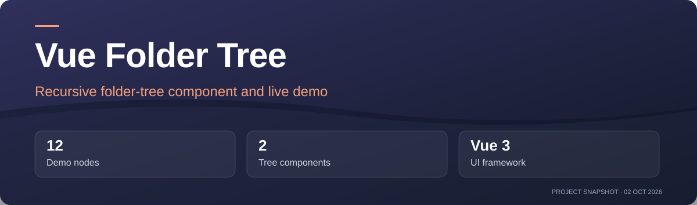
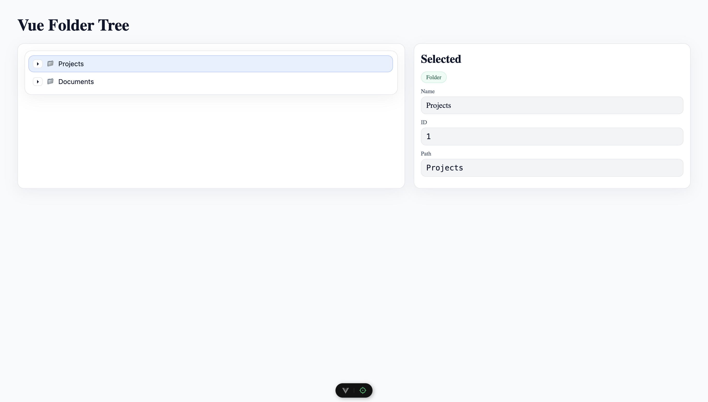
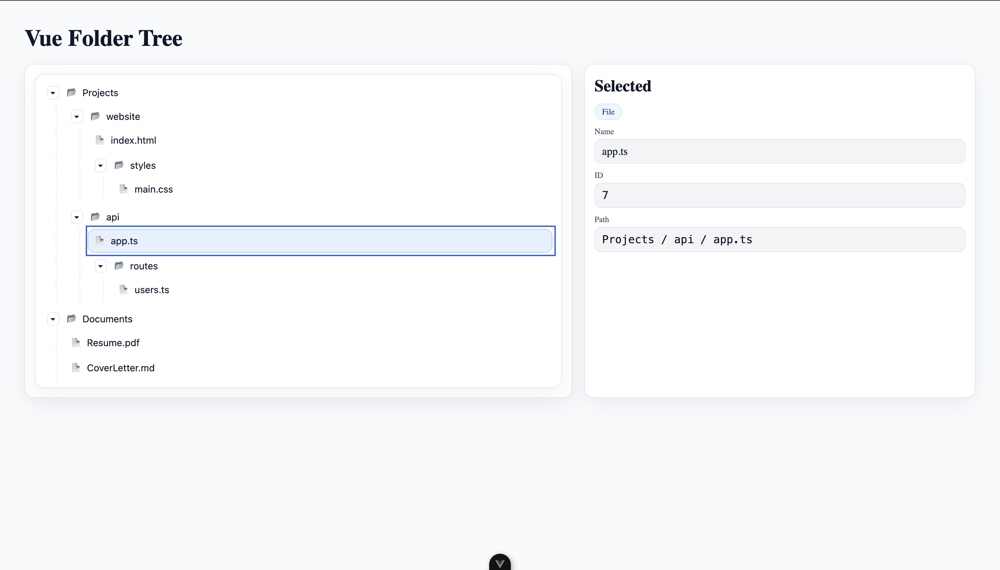

<!-- project-presentation:start -->



**[Open project](https://igor-vuta.github.io/vue-folder-tree/)** · [Repository activity](https://github.com/igor-vuta/vue-folder-tree/activity)

[](https://github.com/igor-vuta/vue-folder-tree/commits)
[](https://github.com/igor-vuta/vue-folder-tree)

**12** Demo nodes · **2** Tree components · **Vue 3** UI framework

*Project facts checked 2 October 2026. Activity badges update from GitHub.*

<!-- project-presentation:end -->

# Vue Folder Tree

A Vue 3 demo of a recursive folder tree. Select a file or folder to see its name, ID and path; expand folders with animated disclosure controls. [Open the live demo](https://igor-vuta.github.io/vue-folder-tree/).

## Features

- Recursive folders and files from a simple node array.
- Animated expand and collapse controls.
- Selection through `v-model` and a `select` event.
- Configurable folder, open-folder and file icons.
- ARIA tree roles and Up, Down, Home, End, Enter and Space key handlers.

The component declares a `checkboxes` prop, but it does not render checkbox controls yet. Keyboard and screen-reader behavior has not had a complete accessibility audit.

## Screenshots



*The demo shows the tree beside details for the selected node.*



*Nested folders can be expanded and selected.*

## Run locally

The project uses Vite and includes an npm lockfile. With Node 20 or later:

```sh
npm ci
npm run dev
```

| Script | Purpose |
| --- | --- |
| `npm run dev` | Start the local development server |
| `npm run build` | Create a production build in `dist/` |
| `npm run preview` | Serve the production build locally |

GitHub Actions builds and deploys the `main` branch to GitHub Pages.

## Data model

```ts
type TreeNode = {
  id: string | number
  name: string
  isLeaf?: boolean
  children?: TreeNode[]
}
```

The demo data lives in `src/mockFolders.ts`. The two recursive tree components are `src/components/FolderTree.vue` and `src/components/FolderTreeNode.vue`.

## Component API

`FolderTree` requires a `nodes` array and accepts an optional `v-model` selection. Pass `icons` to replace its folder, open-folder and file symbols. It emits `select` and `update:modelValue` with the selected ID.

```vue
<FolderTree v-model="selectedId" :nodes="folders" @select="onSelect" />
```

The tree handles Up, Down, Home and End for selection and Enter or Space for expansion. Clicking a folder's disclosure button toggles its children; clicking a row selects it.

## Stack and license

Vue 3, TypeScript Vue components and Vite. The source is available under the [MIT license](LICENSE).
